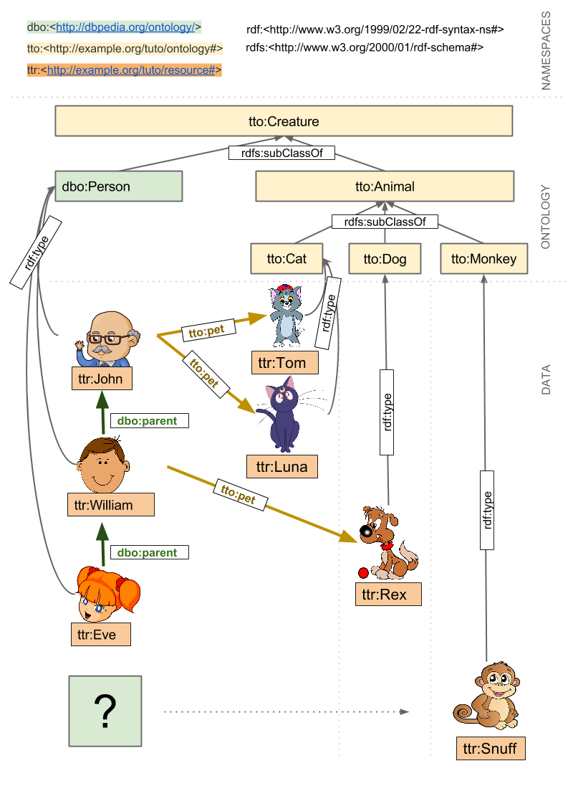

# Linked Metadata exercises
## 1st Part: Learning SPARQL
Please follow this link below:
1.	Download GraphDB Free from : https://www.ontotext.com/products/graphdb/graphdb-free/. You'll need to register with an existing email address, after which you will have the option to download a standalone, Mac or Windows version. Follow the relevant installation procedure, and you should end up in a webpage at [localhost:7200](localhost:7200) in the GraphDB tutorial. In case of trouble, refer to the quick start guide: http://graphdb.ontotext.com/documentation/free/quick-start-guide.html
3.	Create a repository for the SPARQL exercise: http://graphdb.ontotext.com/documentation/free/quick-start-guide.html#create-a-repository
In short, go to your local instance (often accessible via http://localhost:7200). Click on setup on the left -> then on repositories -> Create new repository -> Give it a name and leave the rest as default.
Once created, go to setup -> repositories -> connect to your created repository if you not already did that.
4.	Enable Autocompletion. This is an autocomplete feature that will help searching for variable names.
       Left panel of GraphDB click on Setup -> Autocomplete -> set the switch to "on"
  
5.	Download the example files data ([ontology.ttl](ontology.ttl), [resource.ttl](resource.ttl)) 
into graphdb -> Import -> RDF -> Upload RDf files -> select both files -> files should appear in the graphdb overview. Click import on both files (use default settings).
6.	You can now query your data! Go to SPARQL and write your first queries…
 
## Understanding the basics
To understand the basics of SPARQL and directly querying it we are going to use a very basic database.
This database is stored in the "basic" folder of the exercises. The ontology and the resource file need to be loaded into graphdb in a repository of your own making.
This database, developed by the Swiss Bioinformatics Institute, consists of the following elements: 


 
This database consists of a large variety of creatures. Some are further classified as Persons while others are falling under the Animal category.  
SPARQL/RDF work according triple statements as directed by the arrows.  
For example John is of Type Person.  
To reduce the amount of typing in this exercise these are the prefixes used:
* PREFIX dbo:<http://dbpedia.org/ontology/>
* PREFIX dbp:<http://dbpedia.org/property/>
* PREFIX dbpedia:<http://dbpedia.org/resource/>
* PREFIX rdf:<http://www.w3.org/1999/02/22-rdf-syntax-ns#>
* PREFIX rdfs:<http://www.w3.org/2000/01/rdf-schema#>
* PREFIX tto:<http://example.org/tuto/ontology#>
* PREFIX ttr:<http://example.org/tuto/resource#>
* PREFIX xsd:<http://www.w3.org/2001/XMLSchema#>

**These prefixes are to be placed at the top of each query executed and in GraphDB should be automatically added upon writing the queries**

## Exercises
In the top right Choose repository select BASIC. Then select SPARQL on the left to obtain the SPARQL interface from GraphDB.
When executing a query, all URLs (in blue) can be clicked upon which gives additional information and gives insights into what other properties can be directly queried from this statement.

**In the following exercises, try to fill in the ellipses (...) to make the queries work.**


1. Select all things that are Persons...
Selects subjects connected to the object dbo:Person via the predicate rdf:type. `?thing` is the only variable.

```
SELECT ?...
WHERE {
	?person rdf:type dbo:.... .
}
```

2. Select all persons that are Female...
Using the results from the previous query you can browse to get more information. For example when clicking on John, it shows that it has a birthdate, a name and what else?

```
SELECT ?person
WHERE {
   ?person rdf:type dbo:... .
    ?person tto:sex "" .
}
```

3. What does this query do?...
```
SELECT ?thing
WHERE {
  ?thing tto:sex "female" .
}
```

4. Select persons and their pets...
In this query we ask for more than one thing. Namely a person and their pets.
```
SELECT ?person ?pet
WHERE {
	?person rdf:type dbo:xxx .
  ?person tto:xxx ?pet .
}
```
5. Select persons and if they have one, their pets...
In this case we do not want to be very strict. We would like to know who has a pet and who does not.

```
SELECT ?person ?pet
WHERE {
	?person rdf:type dbo:xxx .
  optional { ?person tto:xxx ?pet }.
}
```	

Nearly identical to the previous statement but here we use the **OPTIONAL** around one or more statements.

6. Who does not have a pet?...
Which persons do not have a pet using a **filter** and **not exists**
```
SELECT ?person ?pet
WHERE {
	?person rdf:type dbo:xxx .
	FILTER NOT EXISTS {?person tto:xxx ?pet }.
	}
```
Again we first select the persons in the database and through the **filter** we return all persons that do not have this statement.

7. Which direct subclassess are connected to a creature...
As can be seen in the figure there are classess who are subclass of other classess. For example a Person is a subclass of a Creature. These subclass relations are connected via rdfs:subClassOf a standard in SPARQL and RDF.
```
SELECT ?subSpecies
WHERE {
	?subSpecies rdfs:subxxx tto:Creature .
}
```
This returns the first level of subclassess that are connected to the Creature class.

8. Which subclassess are all connected to a creature... 
As can be seen in the figure there are also classess connected to the subclassess of creature. For example a Cat is a subclass of Animal which is a subclass of a Creature. These subclass relations are connected via rdfs:subClassOf a standard in SPARQL and RDF.

There are different ways to express the property path level

  - path* -> means 0 or more
  - path+ -> means 1 or more
  - path? -> means 0 or 1 
```
SELECT ?subSpecies
WHERE {
	?subSpecies rdfs:subxxx+ tto:Creature .
}
```	
This returns the first level of subclassess that are connected to the Creature class.

9. Select all animals...
When looking at the figure you can see that Cat, Dog and Monkey are a subclassof Animal. These subclassof relations are in place to group one or more classess to a parent class. 
```
SELECT ?thing ?type
WHERE {
	?type rdfs:subClassOf+ tto:xxx .
  ?thing a ?type .
}
```
	
We ask for many kind of animals here. Cat, Dog and Monkey all part of the Animal class. To get the parent class of a Person/Cat/Dog... you use rdfs:subClassOf. As a class can be a subclassof another class which in turn can be a class of another subclass you can use a + in your query. This will retrieve all entries that in some distance a connection to Animal. 

10. Select the grandfather of Eve
Try to obtain the grandfather of Eve through the dbo:parent property. 
```
SELECT ?grandfather
WHERE {
	ttr:Eve dbo:parent  .... .
	...   ...  ?grandfather  .
}
```
Here we use the dbo:pxxx twice to retrieve the father of the father

11. Select the grandfather of Eve using SequencePaths
The previous query as shown here can be more simplified using SequencePaths. Try to combine the two statements using a "/"
```
SELECT ?grandfather
WHERE {
	ttr:Eve dbo:xxx / dbo:xxx ?grandfather  .
}
```	
Here we use the dbo:xxx twice without any variable in between. This tells sparql that the "object" of Eve is to be used directly as a subject in the next dbo:xxx statement. 		

12. What does the following query do?  
```
SELECT *
WHERE {
  ?creature dbp:name ?name .
  FILTER ( REGEX(?name, "^[RI].*x$" ) )
}
```
[REGEX cheat sheet](https://i.imgur.com/UTlGckN.png)

13. Filter for a particular weight range (5 - 7 kg)...
Using the tto:weight we can retrieve the weight value and use FILTER to select a range.
```
SELECT ?thing ?weight
WHERE {
	?thing tto:.... ?weight .
	FILTER (?weight > ... && ?weight < ...) 
} ORDER BY ?...
```	

Using the && symbols you can apply a double filter here. First we filter for all the weights above 5kg and secondly for all the weights below 7kg.
